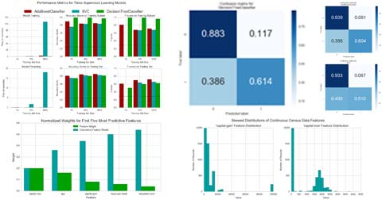
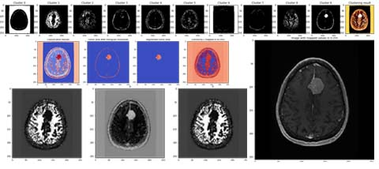

## Portfolio

---

### Academic Projects 

[Analyzing Baseball Data & Predict the Winners of 2020 Series](https://github.com/afshin-arab/afshin-arab.github.io/blob/37218a0646fecf45c130ebc66a8d0389e37690bc/projects/Baseball%20Project/Project.pdf)

---
[Finding Donors for Charity](https://github.com/afshin-arab/afshin-arab.github.io/blob/829c6bee6640fda3f42282762fe710bf1606a2ea/projects/Finding%20Donors%20for%20Charity/Project.ipynb)

---
[Brain Tumor Detection](https://github.com/afshin-arab/afshin-arab.github.io/blob/6aaf310784f4efa998a57ecf3f0fa29c111f85f1/projects/Brain%20Tumor%20Detection/Project.ipynb)

---

### Other Personal Projects:

- [Uber Fare Prediction](projects/Uber Fare Prediction/Project.ipynb)
- [3-Way Sentiment Analysis for Tweets](projects/Sentiment Analysis for Tweets/Project.ipynb)
- [Predict the status of Hotel Bookings](projects/Predict status of Hotel Booking/Project.ipynb)
- [Creating Customer Segments](projects/Customer Segments/Porject.ipynb)
- [Boston Housing Prices](projects/Boston Housing Prices/Project.ipynb)

---

---

Page template forked from <a href="https://github.com/evanca/quick-portfolio">evanca</a>

<!-- Remove above link if you don't want to attibute -->
